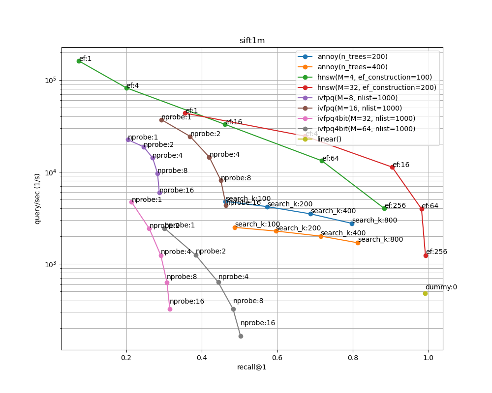
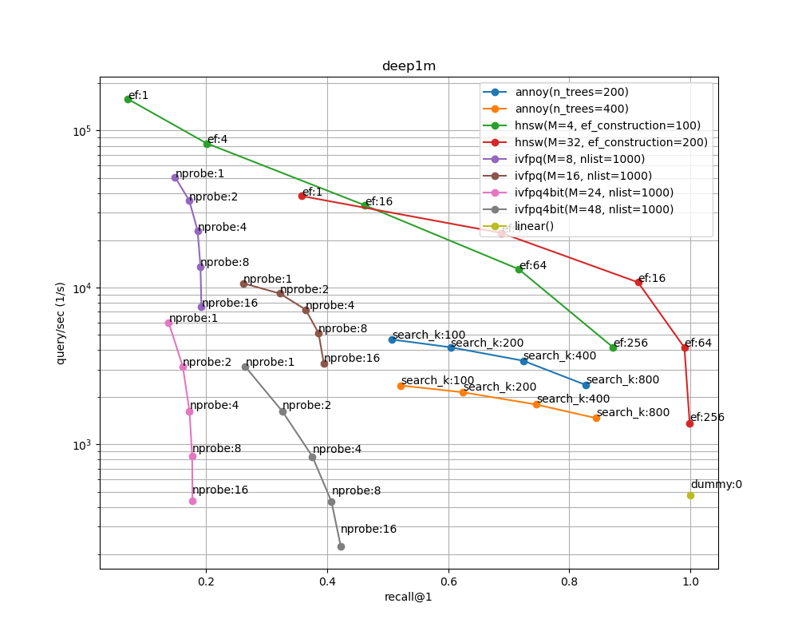

# annbench_leaderboard
A learderboard of [annbench](https://github.com/matsui528/annbench)

## Run by CI via native gh-action
- Create a `default_action` branch and open a PR.
- GitHub actions automatically run `annbench` and write a result on the PR page (powered by [CML](https://cml.dev/))
- If you want to run again, go to the action page and click "Re-run jobs"
- This CI is for a quick test of algorithms and datasets.

## Run by CI via aws ec2
- Launch an aws instance with a usual Ubuntu (not DL-ami)
- Set the instance as a self-hosted runner at GitHub setting
- Create a `aws_action` branch and open a PR
- GitHub actions automatically run `annbench`, write a result on the PR page, and commited the result on this git repository
- This CI is for an actual benchmark

## Result

### sift1m

### deep1m

