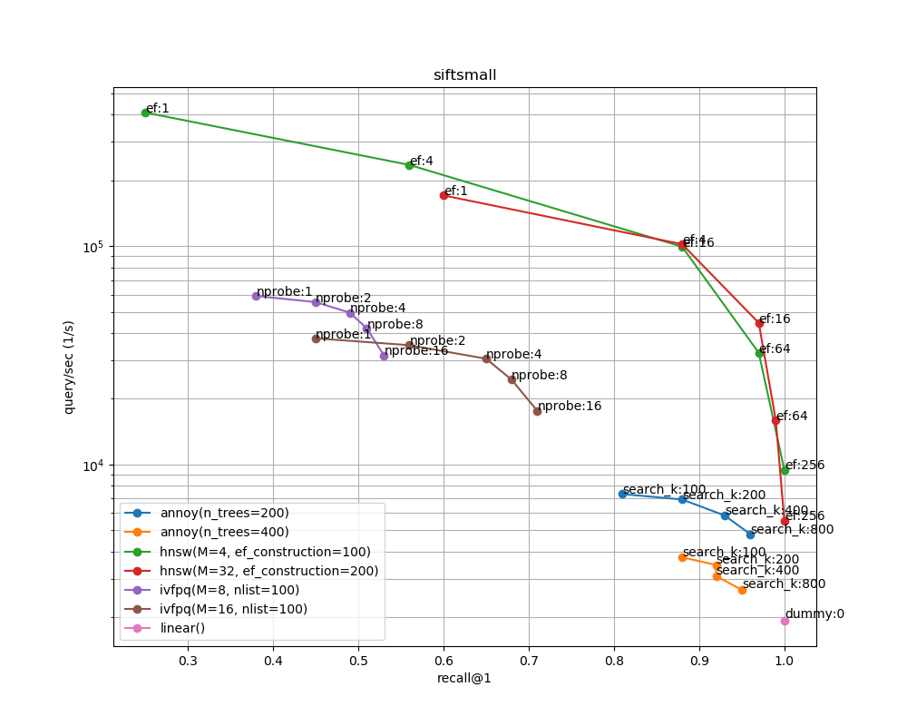
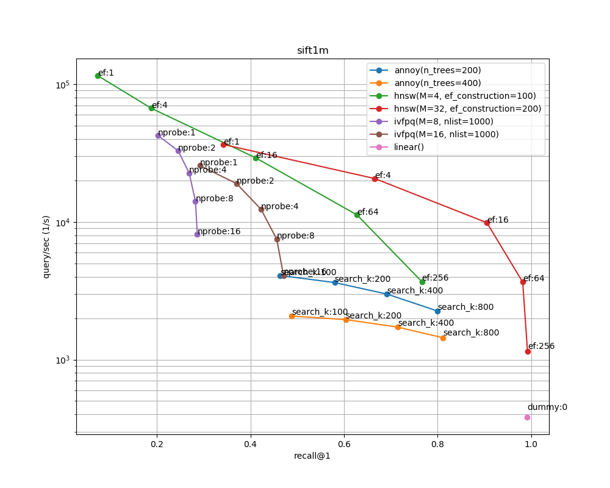

# annbench_leaderboard
A learderboard of [annbench](https://github.com/matsui528/annbench)

## Run by CI 
- Create a `default_action` branch and open a PR.
- GitHub actions automatically run `annbench` and write a result on the PR page
- Powered by [CML](https://cml.dev/)

## Result
- Run on `c5.4xlarge` on AWS, with `Deep Learning AMI (Ubuntu 18.04) Version 27.0 - ami-008d8ed4bd7dc2485`.
- Evaluated on March 16, 2020

### siftsmall


### sift1m



### Commands to reproduce
- Note that conda has been already installed in DL AMI.
```bash
git clone https://github.com/matsui528/annbench.git
cd annbench
pip install -r requirements.txt
conda install faiss-cpu -y -c pytorch
python download.py --multirun dataset=siftsmall,sift1m
python run.py --multirun dataset=siftsmall,sift1m algo=linear,annoy,ivfpq,hnsw
python plot.py
```


## todo
- automate this by github actions
