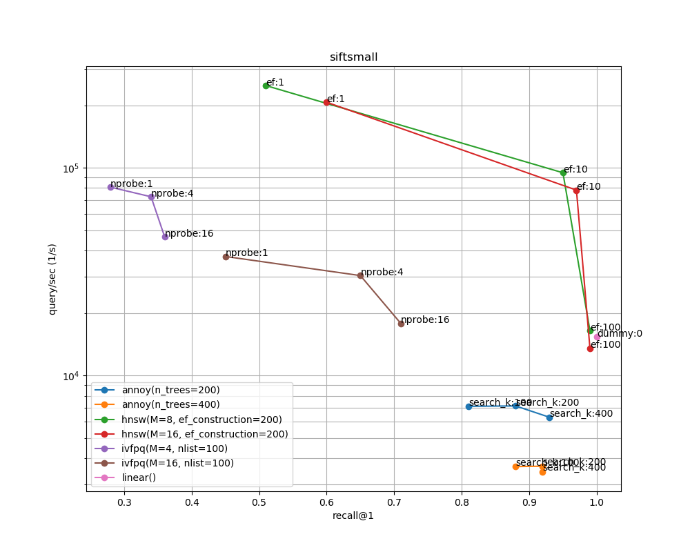
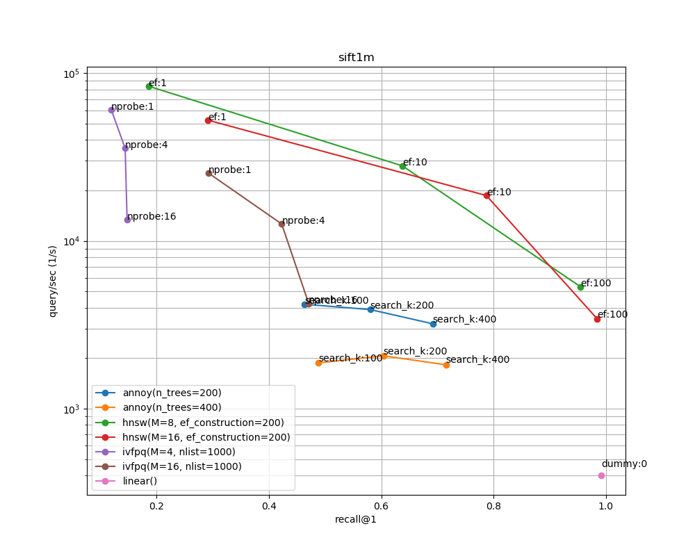

# annbench_leaderboard
A learderboard of [annbench](https://github.com/matsui528/annbench)

## Result
- Run on `c5.4xlarge` on AWS.
- Evaluated on March 14, 2020

### siftsmall


### sift1m



### Commands to reproduce
```bash
sudo apt -y update
sudo apt -y upgrade
sudo apt -y install build-essential
wget https://repo.anaconda.com/archive/Anaconda3-2020.02-Linux-x86_64.sh -O $HOME/aconda.sh  
bash $HOME/anaconda.sh -b -p $HOME/anaconda
echo 'export PATH="$HOME/anaconda/bin:$PATH"' >> $HOME/.bashrc
source $HOME/.bashrc
conda update conda --yes
conda update --all --yes

git clone https://github.com/matsui528/annbench.git
cd annbench
pip install -r requirements.txt
conda install faiss-cpu -y -c pytorch
python download.py --multirun dataset=siftsmall,sift1m
python run.py --multirun dataset=siftsmall,sift1m algo=linear,annoy,ivfpq,hnsw
python plot.py
```


## todo
- automate this by github actions
